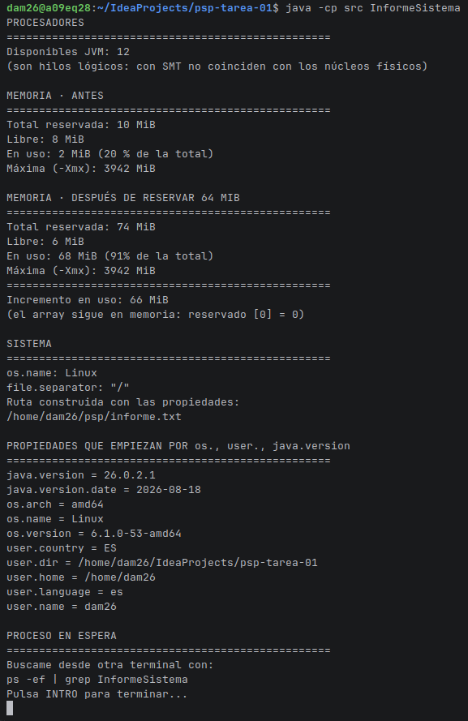
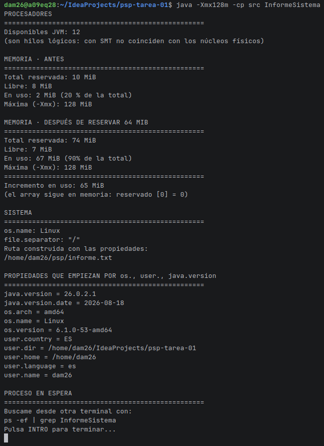
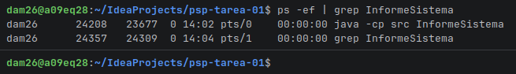
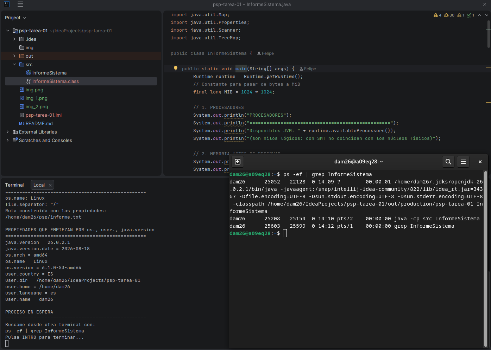

# Tarea 01: Radiografía del sistema

## 1. Capturas de pantalla

### Ejecuciones del programa
* **Ejecución normal:**
  >

* **Ejecución limitando la memoria (`java -Xmx128m InformeSistema`):**
  >
### Búsqueda del proceso desde la terminal (`ps`)
* **Ejecución lanzada desde la terminal:**
  >

* **Ejecución lanzada desde el IDE:**
  >

---

## 2. El proceso, desde fuera

### Identificación de PID y PPID
Al ejecutar `ps -ef | grep InformeSistema` mientras el programa está parado en la lectura por consola, podemos comprobar el PID del proceso y el PPID de su proceso padre:
* **Desde la terminal:** El PPID corresponde al proceso de la propia terminal/shell que estamos usando (`bash`, `zsh`, etc.), ya que es la consola la que ejecuta el comando `java` y arranca la JVM.
* **Desde el IDE:** El PPID cambia porque en este caso el proceso padre es el propio IDE (IntelliJ, Eclipse, NetBeans...), que es el que se encarga de lanzar la Máquina Virtual de Java para ejecutar nuestro proyecto.

### Comparación de las cifras de memoria (Normal vs `-Xmx128m`)
Al añadir la opción `-Xmx128m` a la ejecución, se observan los siguientes cambios en las mediciones:
* **Máxima (-Xmx):** Cambia directamente, pasando del límite por defecto que asigna la JVM según la RAM de la máquina a quedarse fijado en unos 128 MiB.
* **Total reservada:** Disminuye bastante. La JVM no reserva tanta memoria de golpe al inicio porque sabe que su techo máximo de memoria es muy reducido.
* **En uso e incremento:** La memoria consumida por el array de 64 MiB es prácticamente la misma en ambas ejecuciones (~64 MiB), pero el **porcentaje de uso sobre la total** se dispara en la versión limitada (pasa de representar un porcentaje bajo a ocupar más del 50% de la reservada), ya que el margen de memoria es mucho menor.
* **Libre:** Disminuye según la memoria que le queda disponible a la JVM dentro de la reserva actual tras meter el array.

### Ruta multiplataforma
* **En Linux / macOS:** `/home/usuario/psp/informe.txt` (utiliza la barra `/`).
* **En Windows:** `C:\Users\usuario\psp\informe.txt` (utiliza la barra invertida `\`).
* **Explicación:** La diferencia está en cómo maneja las rutas cada sistema operativo. Al usar `System.getProperty("file.separator")` y `System.getProperty("user.home")` evitamos escribir las rutas a mano ("a piñón") y el programa coge automáticamente el separador y la carpeta de usuario que corresponden al sistema donde se está ejecutando.

---

## 3. Qué tipo de programación encaja

### a) Un servidor web que atiende 500 peticiones a la vez en una máquina de 8 núcleos.
* **Tipo:** Concurrente y Paralela.
* **Justificación:** Es **paralela** porque los 8 núcleos físicos del procesador pueden atender hasta 8 peticiones de forma simultánea a nivel de hardware. Y es **concurrente** porque hay 500 peticiones entrantes para solo 8 núcleos, por lo que el sistema operativo tiene que ir alternando e intercalando la ejecución de las tareas en cada núcleo.
* **Inconveniente:** Hay que gestionar con cuidado la sincronización (usando cerrojos, semáforos, etc.) cuando varias peticiones intenten leer o modificar los mismos datos a la vez (por ejemplo, en la base de datos) para evitar condiciones de carrera.

### b) Renderizar una película de animación en un plazo de tres meses.
* **Tipo:** Distribuida.
* **Justificación:** El volumen de trabajo es demasiado grande para un solo ordenador. Se necesita una granja de render (un clúster de varios equipos conectados en red) donde cada máquina procese fotogramas o escenas independientes utilizando su propia CPU y memoria.
* **Inconveniente:** La sobrecarga de red y la latencia. Hay que transferir escenas, texturas y datos muy pesados entre nodos a través de la red, lo que siempre es más lento que trabajar en un único equipo local.

### c) Una app de móvil que descarga un fichero mientras seguís navegando.
* **Tipo:** Concurrente.
* **Justificación:** El hilo de la interfaz de usuario (navegación) y el hilo secundario de red (descarga) se van intercalando. De esta forma la aplicación sigue respondiendo a los toques del usuario y no se queda la pantalla congelada durante la descarga.
* **Inconveniente:** Mayor complejidad en el código. Si no se maneja bien la asincronía o se bloquea el hilo principal por error, la aplicación se colgará y saltará el típico aviso de "La aplicación no responde" (ANR).

### d) Un cálculo que no cabe en la RAM de un solo equipo.
* **Tipo:** Distribuida.
* **Justificación:** Como la memoria RAM física de un solo equipo no alcanza para guardar todos los datos, hace falta conectar varias máquinas en red para repartir la estructura de datos entre las memorias de todos los nodos.
* **Inconveniente:** El rendimiento en los accesos a datos baja notablemente, ya que consultar información que está en la RAM de otro ordenador a través de la red es muchísimo más lento que leer de la memoria RAM local.